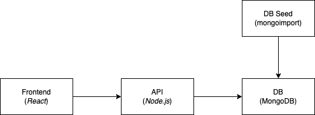
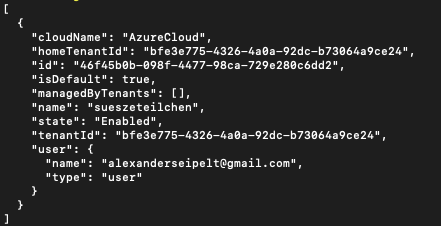
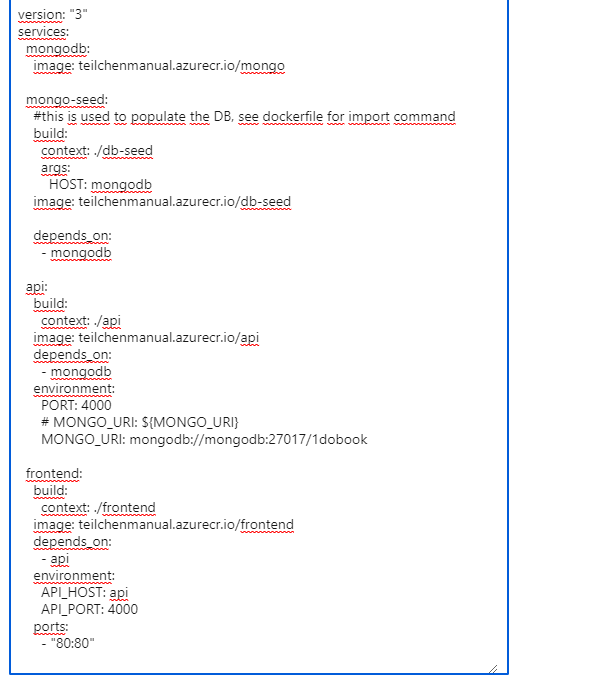

# Application

## Intro

Es handelt sich um eine (ältere) "three-tier" Applikation mit frontend, api, database.
Für diesen Hackathon dient die Applikation nur als Mittel zum Zweck, und die Entwicklung an der Applikation steht hier **nicht** im Fokus. Aus DevOps Sicht ist es trotzdem relevant zu wissen, wie die Architektur der Applikation aussieht und welche Technologien eingesetzt werden, da ihr bei dem Deployment und den Operationstätigkeiten unterstützen sollt.

## Architektur und Verzeichnis Struktur



Im `/application` Verzeichnis findet ihr drei Unterverzechnisse wieder.

- frontend - Das Web Frontend (Presentation Layer) in React geschrieben
- api - Die API (Logik Layer) in Node.js geschrieben
- db-seed - Eine Utility um die Datenbank zu befüllen

Die Datenbank selber ist wie ihr seht nicht als eigenes Verzechnis vorhanden, dass hat den Grund weil es aus Applikations Sicht egal ist wo die Datenbank ist. Gebräuchlich ist dass die Entwickler eine lokale Datenbank, in diesem Fall eine Mongo DB, hochfahren, als ein Container (wird in einer Challenge näher erläutert).

## Frontend

Die Applikation besteht im wesentlichen aus drei Seiten

- `/books` - Übersicht der Bücher und Verleihstatus
- `/books/:bookID` - Detail Seite eines Buches mit Button zum ausleihen und zurückgeben
- `/admin` - Admin Seite um Bücher zu verwalten


# Documentation

### Challenge 4

#### Tutorial for docker and acr

https://docs.microsoft.com/en-us/azure/container-registry/container-registry-get-started-docker-cli?tabs=azure-cli

`docker login`

#### Username
teilchenmanual

#### Find password here


## How to push images to azure registry
1. Go to azure registry teilchenmanual
2. Go to Access keys (Zugriffsschlüssel)
3. Copy & paste the login server, the username and the password
4. Go to the command line and type:
```
docker login teilchenmanual.azurecr.io
```
username is: teilchenmanual \
password is: copy the password from the azure registry \
5. Go to the a folder of your choice
```
# for frontend example
cd frontend
docker build -t frontend teilchenmanual.azurecr.io/frontend
docker tag frontend teilchenmanual.azurecr.io/frontend
docker push teilchenmanual.azurecr.io/frontend
```

### Terraform
```
terraform init
```
oder 
```
terraform init -upgrade
```

```
terraform apply
```

### Deployment nach Azure
1. create mongo:5 image: 
   * docker build -t mongo:5
2. Create an Azure App Service plan:
   * az appservice plan create --name teilchenServicePlan --resource-group meineteilchen --sku B2 --is-linux
   * result:
   
3. Create a Docker Compose app
   * az webapp create --resource-group meineteilchen --plan myAppServicePlan --name teilchenApp --multicontainer-config-type compose --multicontainer-config-file kfw_devops_challenge/application/docker-compose.webapp.yml
4. go to the crated myAppServicePlan to App Service -> Deployment | Deployment Center
   * https://portal.azure.com/#@kfwchallenge.onmicrosoft.com/resource/subscriptions/46f45b0b-098f-4477-98ca-729e280c6dd2/resourceGroups/meineteilchen/providers/Microsoft.Web/sites/teilchen/vstscd
5. setting 
   * Containertyp: Docker Composer
   * Registrierungsquelle: Azure-Containerregistrierung
   * Abonnement-ID: sueszeteilchen
   * Authentifizierung: Administrationsinformationen
   * Registrierung: teilchennmaunel
   * Konfiguration: add-file -> docker-compose.webapp.yml
    see: 
8. check if it works: App Service -> Deployment | Deployment Center | Logs
